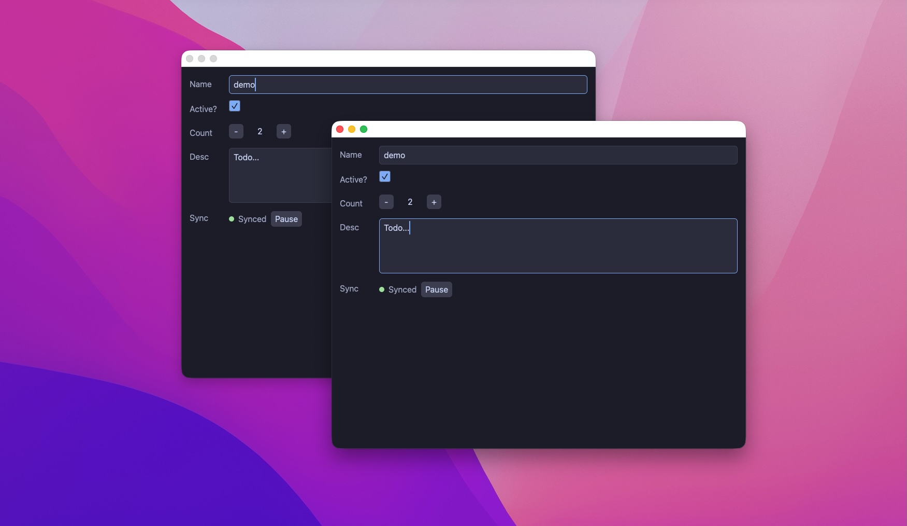

# syncit

<p align="center">
  
</p>

A local first demo using Rust, [GPUI](https://www.gpui.rs), and [Automerge](https://automerge.org).

`syncit` is made up of the following crates:
- [syncit-server](./syncit-server): The sync server
- [syncit-gui](./syncit-gui): The demo desktop app
- [syncit-core](./syncit-core): Holds the shared types being synced
- [syncit-client](./syncit-client): A util cli for watching/editing the synced document

## Running the Demo

Start the sync websocket server

```sh
cargo run -p syncit-server
```

(Optionally) Start the watcher

```sh
cargo run -p syncit-client -- watch
```

Start the GUI

```sh
cargo run -p syncit-gui
```

Start another GUI

```sh
cargo run -p syncit-gui
```

Then make changes in one window and watch them sync to the other.

Or turn off sync in one window (or both), make some changes, then turn on sync and watch the changes appear.

## The Document

The app syncs a simple document with the following fields:

- Name: A string
- Active: A boolean checkbox
- Count: An automerge counter
- Desc: A longer automerge text field

The *name* and *active* fields are pretty much all-or-nothing overwrites.

Count is a special automerge counter -- so the incrementing or decrimenting will be aggregated, rather than overwriting the field with a specific value.

The description field also performs a more granular sync. Meaning two clients can be editing the document at the same time without overwriting eachother's changes (mostly).
 
